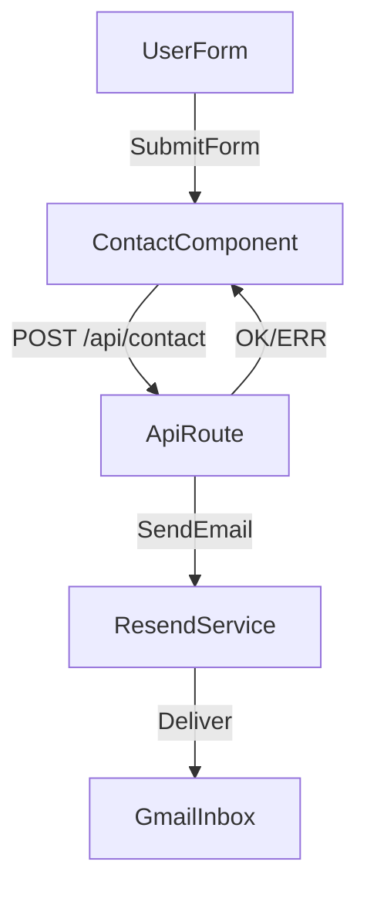

# Contact Form Email Wiring Plan

## Approach

- Implement a server-side email endpoint using a Next.js Route Handler in `app/api/contact/route.ts` that sends mail through Resend.
- Update the form submit handler in `components/contact.tsx` to POST the form data to the API route and keep the current success UI on success.
- Add robust error handling so failures do not crash the UI and can show a safe fallback message.
- Configure required environment variables for Resend on Vercel and locally.

## Files to change

- [app/api/contact/route.ts](app/api/contact/route.ts) — new API route that validates input and sends email via Resend.
- [components/contact.tsx](components/contact.tsx) — update `handleSubmit` to send form data to the API route instead of a timeout, and manage success/error state.
- [package.json](package.json) — add `resend` dependency.
- [.env.local](.env.local) — add `RESEND_API_KEY` and `CONTACT_TO_EMAIL` (documented, not committed).

## Key data flow

## Validation and safety

- Validate `name`, `email`, `subject`, `message` in the API route; return 400 for missing/invalid fields.
- Use try/catch around Resend call; return 500 on failure and keep UI stable.
- Keep the current success UI and only set `isSubmitted` on successful response.

## Notes

- Resend requires verifying a sending domain or using the default sandbox domain for testing. We will use the `from` address required by Resend.

## Todos

- setup-resend: add `resend` package and env var placeholders
- api-route: add `app/api/contact/route.ts` with validation and Resend send
- client-submit: update `handleSubmit` to POST data and handle errors
- verify: run a quick local test and document Vercel env setup
